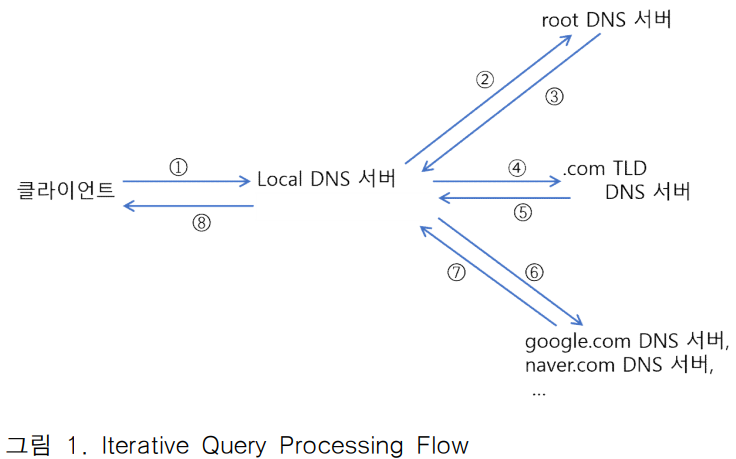
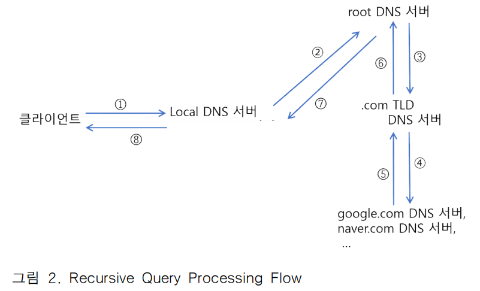

# 프로젝트 개요
***도메인 네임을 주소로 바꿔주는 가상의 DNS name resolution 기반 서비스를 로컬 환경에서 구현한다.***

1. Client 프로세스는 Local DNS server에 query로 도메인 네임을 전달하고 
2. Local DNS server는 자신의 cache에
    - 해당 query의 답이 있으면 바로 reply 하고,
    - 아니면 클라이언트를 대신하여 하나 이상의 다른 DNS server들을 통해 해당 query의 답을 알아낸 후 이를 클라이언트에게 전달한다(recursive query 또는 iterative query). 이 때 query를 처리하면서 얻는 정보를 자신의 cache에 저장하고 이후 들어오는 query에 대해 cache를 최대한 활용한다.

    
    
    
### 조건
1. 각 프로세스 사이의 통신은 모두 UDP를 사용한다.
2. 실제 DNS 서버의 cache엔 여러 형태의 RR이 저장되지만 이 프로젝트에선 CNAME, NS, A만 사용한다.
3. DNS서버 간 UDP통신에서 IP주소는 모두 `localhost:127.0.0.1`을 사용하고 port번호로 프로세스를 식별한다.
4. RR에 저장된 IP 주소는 모두 출력을 위한 가상의 IP주소이다.
5. 모든 DNS서버 cache의 저장공간과 저장된 정보의 유효기간은 무한대라고 가정한다.

### 프로젝트 실행
> ***Ubuntu 18.04.6 LTS 를 사용***

#### 1. init.py 로 cache 초기화 ***(생략 가능)***
local DNS서버의 cache를 초기화한다.
```shell
python init.py
```
#### 2. DNS서버 실행
`localDNSserver.py`, `rootDNSserver.py`, `comTLDDNSserver.py`, `companyDNSserver.py`를 실행한다.

```shell
# 각 명령어는 각자 다른 프로세스에서 병렬로 실행
python localDNSserver.py 23002
python rootDNSserver.py 23003
python comTLDDNSserver.py 23004

python companyDNSserver.py 10001 abcdef.txt
python companyDNSserver.py 10002 xyz.txt
```
명령어 실행 후 recursive 처리 수락 여부와 cache 출력 여부를 설정한다.

#### 3. client.py 실행
client 실행 후 Name resolution할 도메인을 입력한다.
```shell
#예시
python client.py 23000
ipaddr <domain>
```
#### *name resolution 가능한 도메인 목록*

|domain|IP|domain|IP|
|------|--|------|--|
|www.abcdef.com|77.88.99.49|blog.abcdef.com|46.48.111.222|
|ftp.abcdef.com||www.xyz.com||
|www.xyz.com|203.249.88.112|blog.xyz.com|234.22.1.89|
|ftp.xyz.com|120.120.120.129|shop.xyz.com||
|www.example.com|152.2.31.11|blog.example.com|123.55.61.31|
|ftp.example.com||shop.example.com||
|ttt.example.com|77.77.77.77 (A타입)

***새로운 IP 또는 company 추가하는 방법***
1. IP 추가  
   IP를 추가할 `company.txt`에 `<*.company.com> , <IP> , <RR_type>`을 추가한다. CNAME일 경우 IP 대신 machine의 이름을 적고 machine에 대한 A타입 RR을 추가한다. (띄어쓰기 반드시 준수!!)
   ```
   # xyz.txt 예시
   machine69.xyz.com , 234.22.1.89 , A
   shop.xyz.com , machine69.xyz.com , CNAME
   ```

2. company 추가  
   - `config.txt`에 `<company_name>_dns_server = [ dns.<company_name>.com : <IP> ] <port #>`를 추가한다.
   - `textFiles/`에 `<company_name>.txt`를 추가하고 IP를 추가한다.

### 프로젝트 실행 예시
localDNSserverCache.txt를 열어 caching 확인
```shell
# python init.py 로 초기화 후
# 1. root recursive = ON, TLD recursive = ON
ipaddr www.abcdef.com
ipaddr www.abcdef.com

# 2. root recursive = ON, TLD recursive = OFF
ipaddr www.abcdef.com
ipaddr www.example.com
ipaddr www.example.com

# 3. root recursive = OFF, TLD recursive = ON
ipaddr www.xyz.com # TLD server caching
ipaddr www.xyz.com
ipaddr ftp.xyz.com
ipaddr ftp.xyz.com

# 4. root recursive = OFF, TLD recursive = OFF
ipaddr ftp.abcdef.com # abcdef authoritative caching
ipaddr blog.abcdef.com
ipaddr shop.abcdef.com # CNAME만 추가
ipaddr blog.xyz.com # xyz authoritative caching
ipaddr shop.xyz.com
ipaddr ttt.example.com

# optional
ipaddr www.example.com
ipaddr ftp.example.com
ipaddr blog.example.com
ipaddr shop.example.com

# 잘못된 도메인
# 1. root recursive = ON
ipaddr waa.adfada.net 
ipaddr www.adfadf.com
ipaddr aaa.abcdef.com

# 2. root recursive = OFF, TLD recursive = ON
# init 후
ipaddr www.adfadf.com # TLD 서버 caching
ipaddr www.adfadf.com
ipaddr aaa.abcdef.com

# 3. root recursive = OFF, TLD recursive = OFF
# init 후
ipaddr aaa.abcdef.com # TLD, abcdef caching
ipaddr aaa.abcdef.com
```
---
#### 메세지 구조 - dictionary 사용
*message*
```python
message = {
    'reply' : False, # not reply message
    'domain': # domain for name resolution,
    'via': # path of message,
    'recursiveFlag': # recursive query request flag,
    'rootRecursiveFlag': # root accept recursive query,
    'cachingRR_1': # RR_1(A type) caching to local DNS server,
    'cachingRR_2': # RR_2 caching to local DNS server(optional),
    'nextDest': # next destination of message(use in iterative query),
    'authoritative': # whether reply is authoritative(default = False)
}
```
*reply message*
```python
reply_message = {
    'reply' : True, # reply message
    'domain' : # domain for name resolution,
    'IP': # result of name resolution,
    'via': # path of message,
    'cachingRR_1': # RR_1(A type) caching to local DNS server,
    'cachingRR_2': # RR_2 caching to local DNS server(optional),
    'authoritative': # whether reply is authoritative(default = False)
}
```
---
### 파일
### 텍스트 파일
#### 1. config.txt
> 모든 서버들이 실행 될 때 필요한 데이터를 읽어오는 파일

#### 2. localDNSserverCache.txt, rootDNSserverCache.txt, comTLDDNSserverCache.txt
> local, root, comTLD DNS 서버들의 cache가 저장된 파일

#### 3. abcdef.txt, xyz.txt, example.txt
> 가상 회사들의 domain에 대한 A, CNAME type RR이 저장된 cache 파일

### 서버 파일
#### 1. client.py
> query 생성 후 local DNS server로 전송

#### 2. local DNS server.py
> client로부터 전달받은 query 처리

1. cache에 domain이 존재할 경우
    - cache에서 IP를 reply message에 담아 client로 전송
2. cache에 domain이 존재하지 않을 경우
    - authoritative server, TLD server 각각 caching되어있는지 확인:  
      caching 되어 있을 경우 authoritative, TLD server 순서대로 message 우선 전송 후 recursive 처리 여부에 따라 알맞은 경로를 거쳐 client에 reply message 전송
    - 둘 다 caching되어 있지 않을 경우:  
      root 서버로 message 전송 후 recursive 처리 수락 여부에 따라 알맞은 경로를 거쳐 client에 relpy message 전송

#### 3. rootDNSserver.py
> local DNS server로부터 받은 message를 recursive 또는 iterative 처리. recursive 처리를 수락할 경우 하위 서버는 recursive 처리 여부에 상관없이 항상 recursive처리

#### 4. comTLDserver.py
> authoritative 서버들의 NS, A 타입 RR 저장. message를 받으면 해당 domain에 알맞은 authoritative서버 참조, recursive 또는 iterative 처리.

#### 5. companyDNSserver.py
> domain에 대한 name resolution이 완료되는 서버. 

### 기타 파일
#### 1. init.py
> local DNS server의 cache를 초기화

#### 2. msg_utils.py
> message를 다루는 메서드들이 들어있는 파일
- `msg_set`:  
   reply message를 얻기까지 서버 간 주고받는 메세지를 생성하고 데이터 조작 할 수 있는 메서드

- `msg_reply`:  
   reply messgae를 생성하는 메서드

- `get_value`:  
   message에서 원하는 데이터를 얻을 수 있는 메서드

#### 3. cache_utils.py
> cache에 접근하는  메서드들이 들어있는 파일
- `cache_access`:  
   cache에 접근하여 data를 읽어오거나(r), 찾거나(s), 쓰는(w) 작업을 수행하는 메서드

- `cache_print`:  
   cache를 출력하는 메서드

- `cache_get`:  
   cache에서 RR의 원하는 값을 가져오는 메서드. 